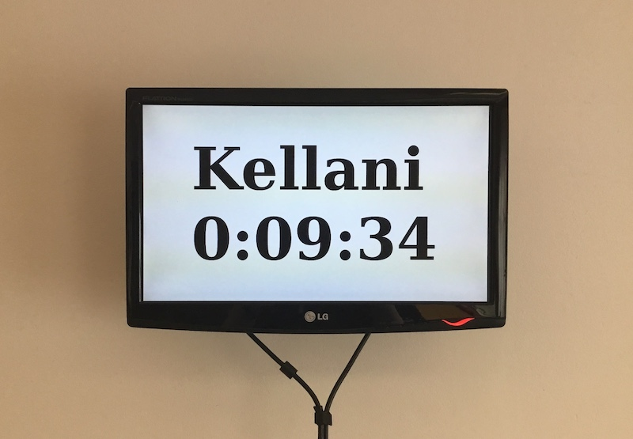

# alamdomeen-kell

See on koolikella rakendus, mis loeb tekstifailist HH:MM kujul sõned ning näitab html lehel suure kirjaga HH:MM:SS kujul, kui kaua on jäänud järgmise koolikellani. Nädalavahetusel, või kui tunnid on lõppenud, ilmub lehele tekst "Mine koju". Rakendusest on kasu näiteks õpetajate toa seinal.



## Rakenduse paigaldamine veebimajutus.ee keskkonda

### Tegevused konsoolis

Logime üle SSH Veebimajutuse keskkonda sisse ja teeme järgmised toimingud:

Loome kõikide virtualenv'ide jaoks kataloogi:
```
mkdir ~/.virtualenvs
```

Loome konkreetse projekti virtualenvi python 3.5'ga, nimetame selle "flask-website":
```
python3.5 -m venv ~/.virtualenvs/flask-website
```

Aktiveerime projekti virtualenvi:
```
source ~/.virtualenvs/flask-website/bin/activate
```

Nüüd on võimalik paigaldada vajalikke mooduleid, kasutades selleks tööriista pip. Paigaldame Flaski (Flask on pisike pythoni koodiraamistik):
```
pip install Flask
```

Paigaldame pythoni FastCGI kaudu jooksutamiseks vajaliku flup mooduli:
```
pip install flup6
```

Kloonime git varamu:
```
git clone https://github.com/hpaves/alamdomeen-kell.git ~/htdocs/alamdomeen-kell/
```

Algses failis on domeeniks melliste.ee, mille asemele tuleb kirjutada teie enda domeen:
```
nano ~/htdocs/alamdomeen-kell/cgi-bin/dispatch.fcgi
```

Muudame kellaajad teie koolile vastavaks. Failis timetable1 on esmaspäevased ajad, failis timetable2 on T-R ajad:
```
nano ~/htdocs/alamdomeen-kell/cgi-bin/timetable1
nano ~/htdocs/alamdomeen-kell/cgi-bin/timetable2
```

Kui teie koolis on kellad iga päev samadel aegadel, siis muutke lihtsalt timetable2, eemaldage timetable1 ja looge timetable1 nimeline sümboolne viide, mis viitab timetable2 peale:
```
nano ~/htdocs/alamdomeen-kell/cgi-bin/timetable2
rm ~/htdocs/alamdomeen-kell/cgi-bin/timetable1
ln -s ~/htdocs/alamdomeen-kell/cgi-bin/timetable2 ~/htdocs/alamdomeen-kell/cgi-bin/timetable1
```

### Tegevused iseteeninduses
Loome Veebimajutuse iseteenindudses alamdomeeni "kell" ning suuname selle "htdocs/alamdomeen-kell" kausta peale.

### Koodimuudatuste rakendumine
Kui veebilehte on juba avatud, siis võib flask protsess jooksmas olla ja koodi muutmise järel ei kajastu kohe muudatused uuel lehe laadimisel. Seetõttu tuleks peale koodimuudatusi jooksev pythoni protsess peatada, et see saaks uuesti lehe värskendamisel värske koodiga tööle hakata.
```
pkill -f dispatch.fcgi
```

### Pythoni veateadete logi
Veebiserveri pealogile pole kahjuks klientidele võimalik ligipääsu lubada, mistõttu ei saa vaadata pythoni koodi veateateid, kuid abiks võib olla koodi käsitsi käivitamine käsurealt:
```
python3.5 ~/htdocs/alamdomeen-kell/cgi-bin/dispatch.fcgi
```

## Rakenduse loomisel kasutatud

* [Python](https://www.python.org/) - Peamine keel
* [Flask](http://flask.pocoo.org/) - Raamistik

## Autorid

* **Henri Paves** - [hpaves](https://github.com/hpaves)

## Litsents

GNU GPLv3 - loe lähemalt failist [LICENSE.md](LICENSE.md)

## Viited

* Algne countdownpy rakendus: https://github.com/hpaves/countdownpy
* Veebimajutuse näidisrakenduse paigaldamise juhend: https://www.veebimajutus.ee/klienditugi/juhendid/pythoni-naidisrakendus-flask/
* Kuidas aegasid võrrelda: https://stackoverflow.com/questions/3096953/how-to-calculate-the-time-interval-between-two-time-strings
* Ma pole HTML guru: https://www.brightcherry.co.uk/scribbles/jquery-auto-refresh-div-every-x-seconds/
